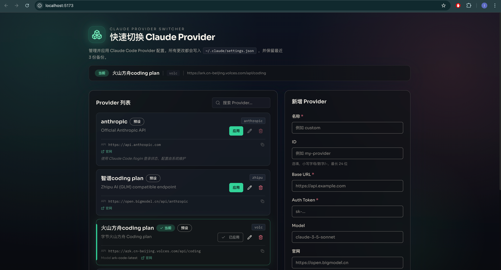

# Claude Provider Switcher

[](https://www.npmjs.com/package/claude-provider-switch)
[](LICENSE)

一键切换 Claude Code 的 API Provider。支持 Anthropic 官方 API 或任何兼容 Anthropic API 格式的第三方服务（如智谱、火山方舟等）。

<p align="center">
  
</p>

## 为什么需要这个工具？

- **多 Provider 管理** — 同时配置多个 API 提供商，随时切换
- **避免手动改配置** — 自动管理 `~/.claude/settings.json`，无需手动编辑
- **安全备份** — 每次修改前自动备份，可随时恢复
- **可视化界面** — 除了 CLI，还提供了直观的 Web UI

## 安装

```bash
npm install -g claude-provider-switch
# 或使用 pnpm
pnpm add -g claude-provider-switch
```

## 快速开始

### 1. 启动 Web UI（推荐）

```bash
cps serve
```

然后打开 http://localhost:8787 即可通过界面管理 Provider。

### 2. 使用 CLI

```bash
# 查看当前配置
cps current

# 列出所有 Provider
cps list

# 切换到指定 Provider
cps set anthropic

# 添加自定义 Provider
cps add my-provider \
  --base-url https://api.example.com \
  --token sk-xxx \
  --model claude-3-5-sonnet
```

## CLI 命令参考

| 命令 | 描述 |
|------|------|
| `cps list` | 列出所有配置的 Provider |
| `cps current` | 显示当前使用的 Provider |
| `cps set <name>` | 切换到指定的 Provider |
| `cps add <name>` | 添加新的 Provider |
| `cps remove <name>` | 删除指定的 Provider |
| `cps serve` | 启动 Web UI 服务 |

## 预设 Provider

首次运行时会自动创建以下预设配置：

| Provider | 说明 |
|----------|------|
| `anthropic` | 官方 API，需先运行 `claude code /login` 登录 |
| `智谱Coding Plan` | 智谱 AI 的 Coding 套餐 |
| `火山方舟Coding Plan` | 火山方舟的 Coding 套餐 |
| `custom` | 占位配置，可自行修改为自定义 Provider |

## 配置说明

### 默认路径

- **Provider 配置**：`~/.config/claude-provider-switcher/config.json`
- **Claude 设置**：`~/.claude/settings.json`
- **备份文件**：`~/.claude/settings.backup-*.json`（保留最近 3 份）

### 环境变量

可通过以下环境变量覆盖默认路径：

```bash
export CPS_CONFIG_PATH=/path/to/config.json
export CPS_CONFIG_DIR=/path/to/config/dir
export CPS_CLAUDE_SETTINGS_PATH=/path/to/settings.json
export CPS_CLAUDE_DIR=/path/to/claude/dir
```

## 开发

```bash
# 克隆仓库
git clone https://github.com/ladieman217/claude-provider-switcher.git
cd claude-provider-switcher

# 安装依赖
pnpm install

# 开发模式（同时启动 UI 和 API 服务）
pnpm run dev

# 构建
pnpm run build

# 测试
pnpm run test
```

## 发布 npm 包

发布前检查：

```bash
pnpm run release:check
```

推荐（自动 bump 版本 + 打 tag + push，触发 GitHub Actions 发布）：

```bash
pnpm run release:patch  # 或 release:minor / release:major
```

手动发布（本地直接发 npm）：

```bash
npm login
pnpm run release:publish
```

说明：
- 实际发布包目录是 `packages/cli`。
- 发布时会自动执行 `lint`、`test`，并在打包前自动构建 UI + CLI。
- 如果启用了 2FA，`npm publish` 会提示输入 OTP。
- `release:patch/minor/major` 会在 `packages/cli` 执行 `npm version`，自动创建 `vX.Y.Z` tag 并执行 `git push origin HEAD --follow-tags`。

## 贡献

欢迎提交 Issue 和 Pull Request！

## License

[MIT](LICENSE)

---

<p align="center">
  Made with ❤️ for Claude Code users
</p>
